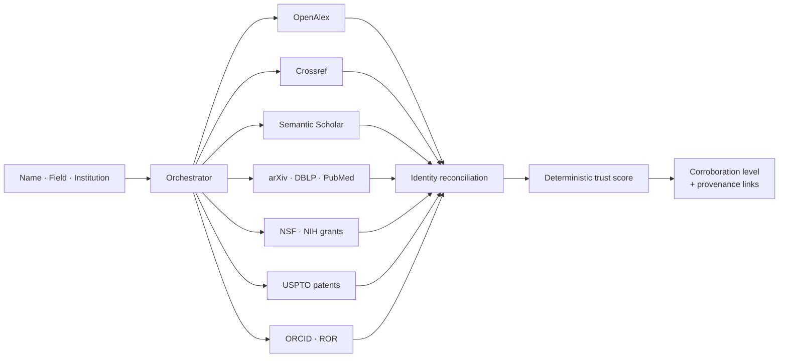

<div align="center">

# PetitionHQ

**Evidence infrastructure for U.S. immigration petitions.**

Corroborates a researcher's claimed record against 11 public academic APIs, scores petition strength deterministically, and drafts filing-grade legal documents behind a hallucination firewall.

[](https://github.com/AdelGasmi/petitionhq/actions/workflows/ci.yml)
[](#quality-gates)
[](tsconfig.json)
[](https://nextjs.org)
[](LICENSE)

`67,735 lines of TypeScript` · `111 API routes` · `604 tests` · `39 migrations` · `built solo`

</div>

---

> ### 📦 Archived — July 2026
>
> The infrastructure is decommissioned and the company is closed. The code is public because the engineering is worth reading and the failure is worth being honest about.
>
> It reached production. It held real users. It never made a dollar — **not because the product failed, but because I never tested whether anyone wanted it.** [Full postmortem →](#postmortem)

---

## Why this repo is worth a look

Most "AI legal tech" is a prompt wrapped in a form. The engineering here is in the **constraints between the model and the output** — because in a regulated profession, a confident wrong answer is the liability.

| The problem | The approach |
|---|---|
| **Two researchers share a name.** Public APIs merge them happily, inflating one person's record with another's work. | Identity-anchored reconciliation. Records merge only when an anchor — ORCID, institution, co-author graph — corroborates. Unanchored matches are downgraded, never silently merged. |
| **LLMs invent citations.** In a legal filing this is career-ending; attorneys have been sanctioned for exactly this. | Every generated sentence is validated against the structured evidence record. Unsupported claims return as flags with character offsets, so the UI jumps the drafter to the exact phrase. |
| **Scores that drift destroy trust.** A reviewer who watches 73 become 72 on re-run stops believing everything else on the page. | Deterministic threshold scoring with fixed band boundaries, architecturally separated from the LLM's qualitative assessment. |
| **Overclaiming is commercially tempting.** "Verified" sells better than what public data actually supports. | The system is structurally forbidden from saying it. A public-record match is *"publicly corroborated"*; only ORCID OAuth yields `identity_confirmed`. Three-tier labels enforced at every read path. |
| **AI-written recommendation letters** read fine to a lawyer and generic to an adjudicator. | A five-dimension critique rubric including `aiSlopFreeness` — flags *"testament to"*, *"paradigm shift"*, *"delve into"*, em-dash abuse, rule-of-three rhythm. It runs against the system's own drafts. |

**The through-line: a system that refuses to assert more than its data supports.**

---

## The verification engine

The core asset, and the piece most worth lifting. Given a name, field, and institution it fans out across 11 public sources, reconciles results against an identity anchor, and emits a corroboration level with a provenance link on every claim.



Design decisions worth noting:

- **Cross-source rescue.** A real researcher absent from one index shouldn't be punished for it — corroboration from any anchored source lifts the record.
- **Citation overclaim detection.** Self-curated profiles inflate. Claimed counts are checked against independently indexed ones.
- **Fraud penalties gated to identity-anchored records.** Penalising an unanchored name match punishes the common-name case far more often than the fraudulent one.
- **Zero baked-in secrets.** The only dependency is a swappable cache — the engine lifts out of this repo cleanly.

📂 [`lib/verification/`](lib/verification/) — 11 source adapters + identity, scoring, and reconciliation layers

---

## The grounding firewall

The mechanism I'd reuse in any LLM product. Generated prose is checked against the structured record, and anything unsupported comes back as a typed flag with offsets:

```ts
export type GroundingFlag = {
  text: string;        // the exact phrase that could not be verified
  reason: string;      // e.g. "Paper not in qualifications.publications"
  severity: "error" | "warning";
  start?: number;      // character offsets, so the UI can jump to it
  end?: number;
};
```

Draft routes stream these to the client over SSE alongside the text itself (`{ t: "grounding" }`), so unsupported claims surface *as the draft is being written* rather than in a review pass nobody does.

📂 [`lib/groundingCheck.ts`](lib/groundingCheck.ts)

---

## Architecture

```
Next.js 15 App Router · React 19 · TypeScript (strict)
  │
  ├── middleware.ts ............ fail-closed auth, role gates, CSP
  ├── app/api/ ................. 111 routes behind a withRoute() error wrapper
  ├── lib/verification/ ........ 11-source engine, identity, deterministic scoring
  ├── lib/drafting.ts .......... LLM drafting, SSE streaming, critique rubric
  ├── lib/groundingCheck.ts .... hallucination firewall
  ├── lib/pii-crypto.ts ........ field-level encryption at rest
  └── prisma/ .................. PostgreSQL 16, 39 migrations
```

| Layer | Choice |
|---|---|
| **Framework** | Next.js 15 (App Router, RSC), React 19, TypeScript strict |
| **Database** | PostgreSQL 16 + Prisma, optimistic concurrency on document versions |
| **Auth** | JWT (`jose`), edge middleware, fail-closed, server-side session revocation |
| **LLM** | Provider router — hosted Anthropic or local LM Studio, no vendor lock-in |
| **Storage** | Local disk or Cloudflare R2, presigned URLs, split public/secure buckets |
| **Payments** | Stripe Checkout, idempotent webhooks, refund reconciliation |
| **Documents** | PDF + DOCX generation, white-label export (no vendor branding on filed work) |
| **Infra** | Docker Compose + Caddy on a single VPS; GitHub Actions → SHA-pinned deploy with health check and automatic rollback |

**Security posture:** field-level PII encryption · fail-closed authorization · webhook idempotency · rate limiting · Turnstile on public endpoints · **zero-trust admin** — administrators structurally cannot open case content; they receive a privacy placeholder, never the workspace.

---

## Quality gates

Every pull request runs typecheck, lint, and the full suite against a real Postgres service container — no mocked database.

```
✓ tsc --noEmit          clean
✓ next lint             no errors
✓ vitest run            604 tests · 51 files passing
✓ next build            production build succeeds
```

📂 [`.github/workflows/ci.yml`](.github/workflows/ci.yml)

---

## Running it locally

```bash
npm install
docker compose up -d          # Postgres, Mailhog, MinIO
cp .env.example .env.local    # placeholder values only
npx prisma migrate dev
node prisma/seed.mjs          # synthetic personas
npm run dev
```

App on `:3000` · mail UI on `:8025`

Defaults to a local LM Studio endpoint, so **no API key is required to run it**. Set `LLM_PROVIDER=anthropic` for hosted models.

> Seed data is entirely fictional. No real user data has ever existed in this repository — verified across all 464 commits of history before release.

---

## Postmortem

I graded this honestly before shutting it down. The scorecard is the most useful artifact in the repo:

| Dimension | Grade |
|---|---|
| Execution velocity | **9** / 10 |
| Technical architecture | **8** / 10 |
| Product completeness | **8** / 10 |
| Security posture | **8** / 10 |
| **Traction / validation** | **2** / 10 |

Final state: **70 leads · 12 consented · $0 revenue · 0 customer conversations.**

The market never rejected this product. It was never shown to the market. I wrote 464 commits and zero sales emails.

**What I'd tell myself at the start:**

1. **Build the smallest thing that can be refused — then go get refused.** Every week of building without a customer conversation widened the gap between what I made and what anyone wanted. Three separate "one more pass" scope freezes were procrastination wearing an engineering costume.
2. **Measurement discipline must match build discipline.** I once read ~100 social engagements as ~100 visitors. It was one person — me — on a mobile browser. I shipped a deterministic scoring engine while having no page-level analytics at all.
3. **Founder–market fit is a real constraint, not a mindset problem.** I could build for immigration attorneys. I could not sell to them, and never seriously tried to learn how. Failing to name that early cost more than any technical decision in this repo.
4. **The honest-labeling discipline was right, and I'd keep it.** Refusing to print "verified" when the data only supported "corroborated" cost conversion and was still correct. In regulated domains, the overclaim *is* the liability.

The engineering here is the best work I've done. It was aimed at a hypothesis I never tested. Both of those things are true, and the second one is the lesson.

---

## License

MIT — see [LICENSE](LICENSE). Take whatever's useful; the verification engine is the piece most likely to be worth lifting.

<div align="center">

**Adel Gasmi** · [GitHub](https://github.com/AdelGasmi)

</div>
