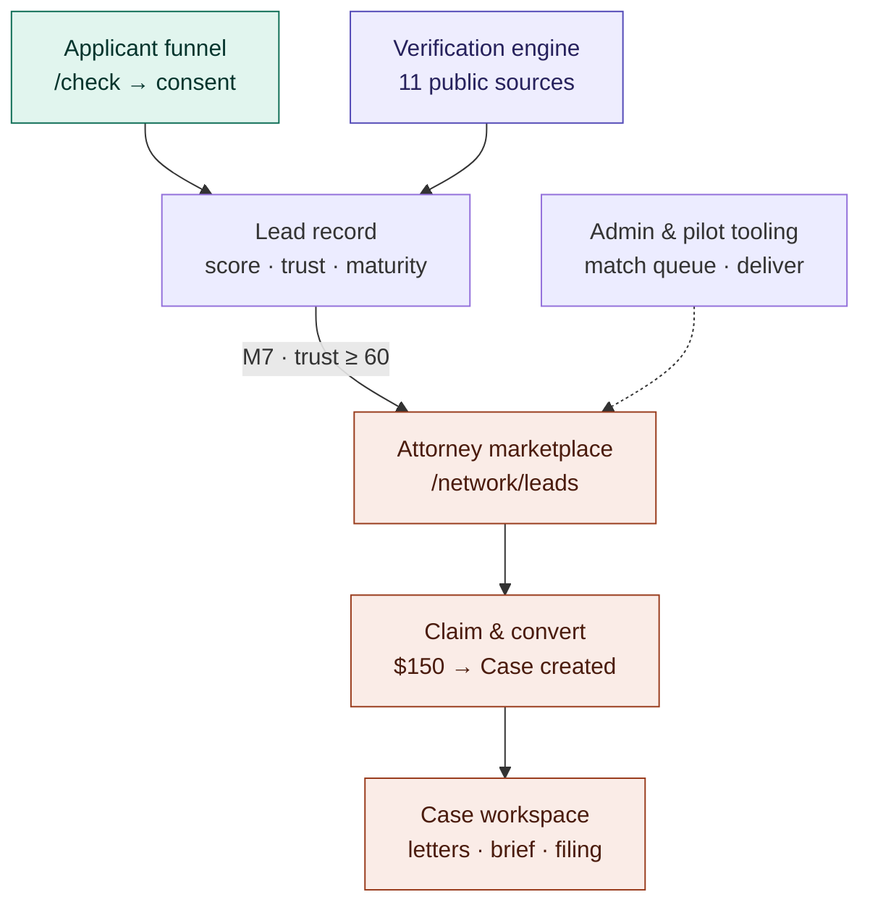

# Product overview

The two-sided product at a glance: the applicant funnel feeds the `Lead`
record, the verification engine corroborates it, and only leads at maturity M7
with `trustScore ≥ 60` cross into the attorney side. See
the architecture overview §0–§4.

Notes:

- Admin never enters the case workspace — `canAccessCase` returns false for
  admins (attorney–client privilege). Their lane is the match queue, pilot
  delivery/outcomes, refund approvals, attestation, and re-verification.
- The two scores are independent: case strength (LLM, `Lead.score`) vs trust
  (deterministic rules, `Lead.trustScore`).
