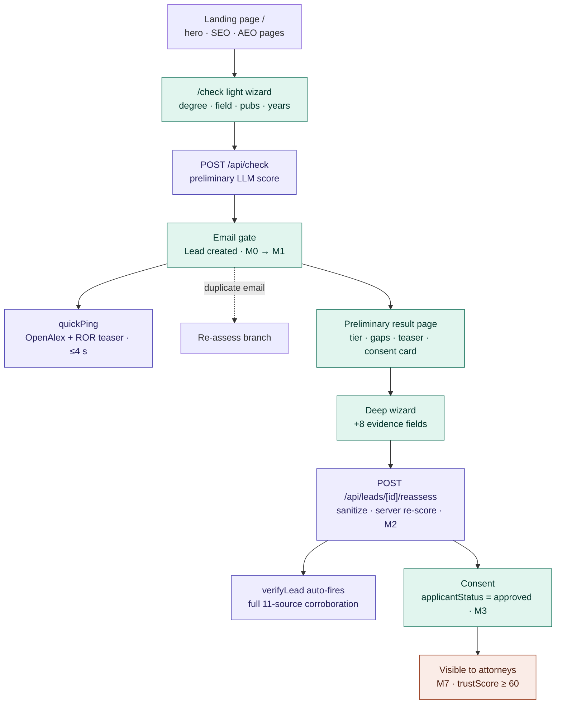

# Applicant funnel

Landing → light wizard → email gate → preliminary result → deep wizard →
consent → attorney visibility. Maturity ladder milestones (M0–M7) ride the
subtitles. See the architecture overview §2.

Notes:

- The email gate sends two emails: lead confirmation (mirrors the preliminary
  result since PR #283) and an admin alert. The authoritative final-score
  email goes out after `reassess`.
- `reassess` sanitizes `formData` against an allowlist, re-derives the score
  server-side from dimensions, and clamps to the evidence ceiling.
- The free-text `field` is validated client + server
  (`isPlausibleResearchField`, G-3).
- The M7 gate is enforced server-side: `GET /leads/[id]` returns 404 to
  attorneys for any sub-M7 lead.
