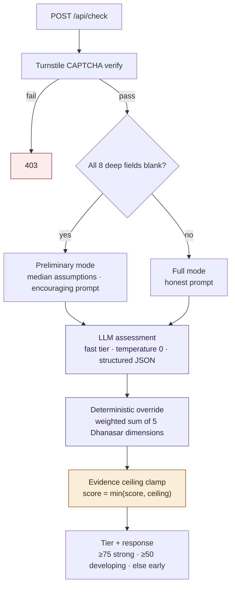

# Case-strength scoring pipeline

`POST /api/check` (`app/api/check/route.ts` + `lib/scoring.ts`). The LLM's own
overall number is discarded: the score is a deterministic weighted sum of the
five Dhanasar dimensions, then hard-capped by the evidence ceiling. See
the architecture overview §1a.

Notes:

- Dimension weights: EB-2 baseline 15% · prong-1 merit 25% · prong-1
  importance 20% · prong-2 25% · prong-3 15%.
- The evidence ceiling is derived only from self-reported
  publications/citations (+ award/grant/patent lifts) — an empty research
  record can never read as Strong.
- The clamp is re-applied at every write/read boundary
  (`clampScoreToEvidence` / `resolveCandidateScore`), so a stored score never
  drifts above the evidence.
- Funnel events `check.started` / `check.completed` fire around the pipeline.
