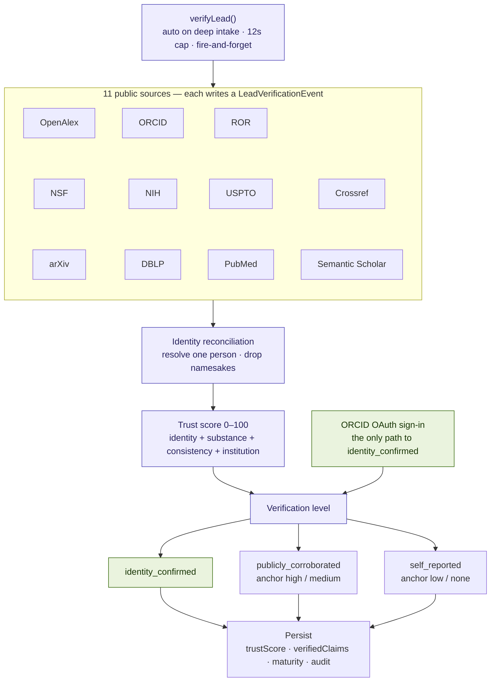

# Verification engine

`verifyLead()` (`lib/verification/orchestrator.ts`): 11 public sources →
identity reconciliation → deterministic trust score → verification level.
Rules only, no LLM. See the architecture overview §1b–§1c and §3.

Notes:

- A ghost (zero agreeing sources) short-circuits the trust score to 0.
- The −15 over-claim penalty fires only on ID-anchored records (TRU-9); a
  name-search match never brands a real, under-indexed researcher an
  over-claimer.
- Cross-source rescue (TRU-7) and OpenAlex fragment merge (TRU-8) protect real
  researchers with common names from false negatives.
- Admin escape hatches: `POST /api/admin/leads/[id]/reverify` and the R0-5
  identity attestation for legit researchers stuck below trust 60.
- Known open issue: Semantic Scholar citation recall is weak for some indexed
  researchers.
