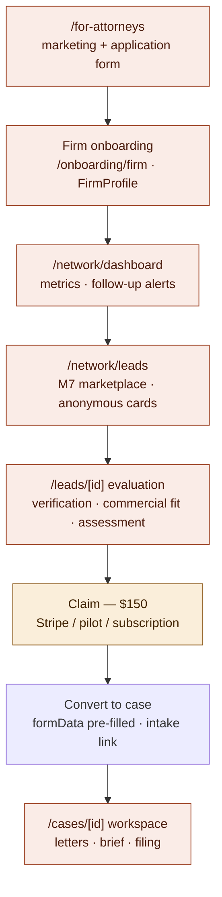

# Attorney funnel

From the marketing page to a working case. See the architecture overview §4.

Notes:

- Pre-claim anonymity: marketplace cards show only "{field} Researcher";
  verification source links unlock only for the claiming attorney.
- Sort options: newest / score / trust — trust and score sorts add
  `orcidAuthenticated desc` as secondary key (TRU-2).
- Lead evaluation sections: Verification & Provenance, Commercial Fit
  (POS-1/2), Profile Snapshot, AI Legal Assessment, Detailed Evidence, Exhibit
  Plan, prong-1 draft teaser.
- Attorney auth includes self-serve password reset via emailed 6-digit code
  (PR #282).
