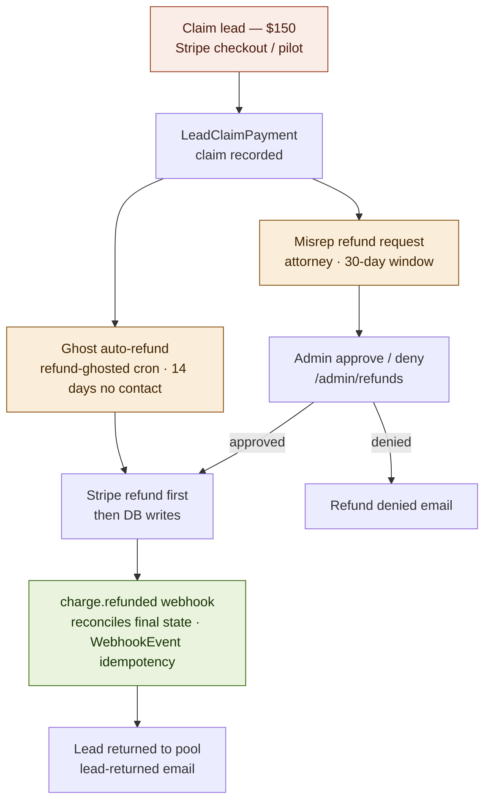

# Claim payment & refund lifecycle

The $150 claim and both refund routes. Stripe-first, then DB writes — never a
Stripe call inside a DB transaction.

Notes:

- The ghost cron runs daily at 08:00 and carries a double-refund guard
  (tightened in the pre-launch pass).
- `release-ghosted-pilots` (daily 08:15) is the pilot-delivery analogue:
  stale concierge deliveries are released back to the pool.
- The `charge.refunded` webhook is the reconciliation source of truth — DB
  state converges to Stripe, not the other way around.
