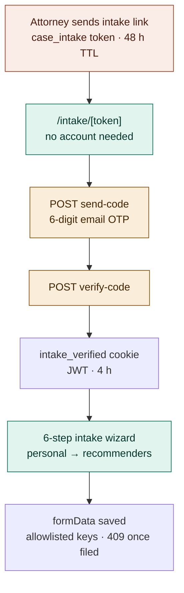

# Applicant intake (OTP-gated)

Case intake without an account: tokenized link + email OTP. No case data is
loaded server-side until the OTP passes. See the architecture overview §5.

Notes:

- Wizard steps: personal info → EB-2 basis → endeavor → publications →
  recognition → recommenders.
- Logged-in case owners use `/cases/[id]/intake` directly (no OTP needed).
- Intake-link generation is attorney-only — admins cannot create intake or
  guest links (zero-trust admin).
- After filing, `Case.formData` is immutable: content PATCH / intake POST
  return 409; status changes remain allowed.
