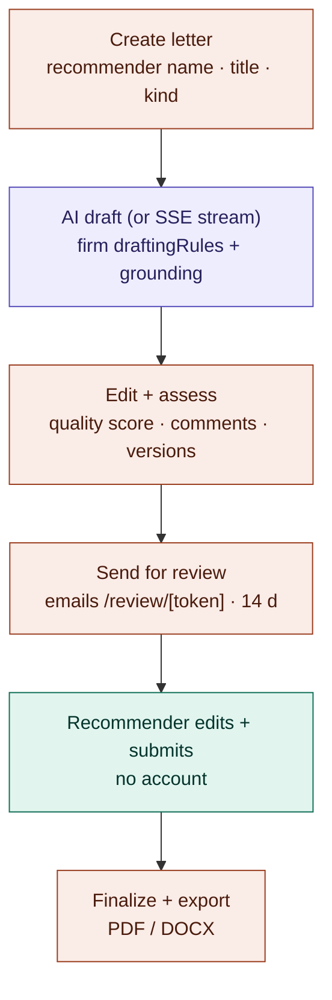
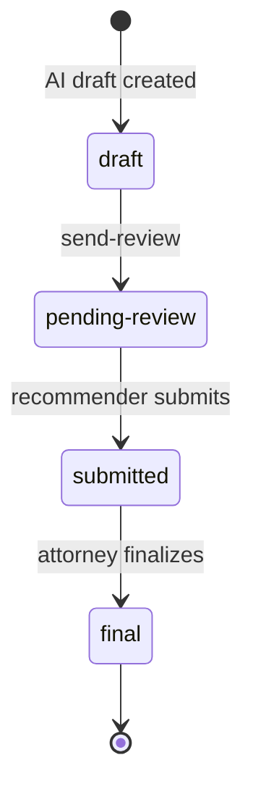

# Recommendation-letter workflow

Attorney drives, AI drafts, recommender reviews through a tokenized portal.
See the architecture overview §5.

## Action flow

## LetterStatus state machine

Notes:

- Every draft/regenerate is versioned in `LetterVersion`; comments live in
  `LetterComment`.
- The `remind-recommenders` cron (daily 09:00) nudges ghosted recommenders at
  day 5 and day 10.
- Letter drafting injects the firm's `/network/rules` preferences; drafting
  temperature is server-capped at 0.45 (default 0.4) regardless of client
  settings.
