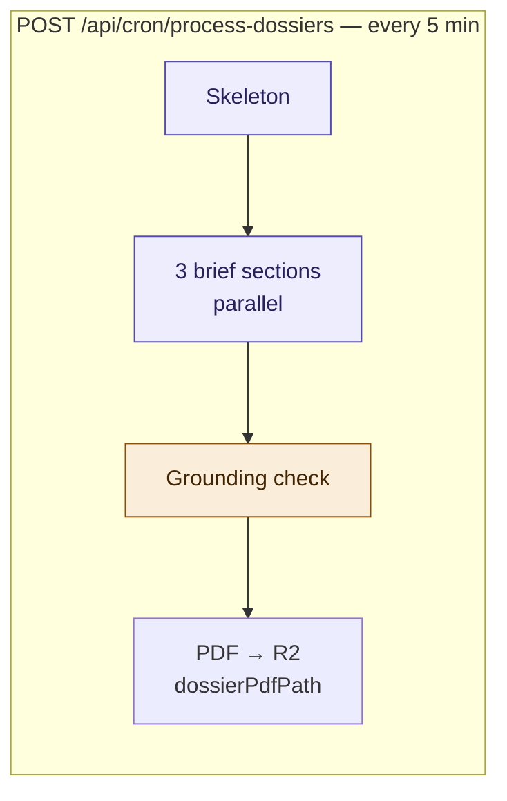
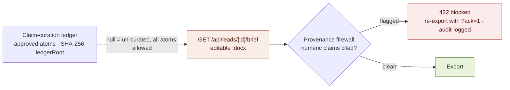

# Dossier & brief generation

Two document paths: the automated dossier preview (cron) and the attorney's
editable `.docx` export behind the provenance firewall. See
the architecture overview §5.

## Dossier cron (un-curated preview)

## Attorney .docx export (provenance firewall)

Notes:

- Dossier PDF page 1 carries the Verification & Provenance table
  (trust + verifiedClaims). Null `claimLedger` ⇒ all atoms allowed; once a
  ledger is signed, generation is approved-atoms-only.
- The firewall (`lib/dossier/provenanceLinter.ts`, TRU-5) flags numeric claims
  lacking a verified-source citation or `[self-reported]` tag.
- The case-workspace brief export (`GET /api/cases/[id]/brief/[n]/export`) is
  white-label PDF/DOCX — no PetitionHQ branding on the attorney's filed work
  product. Eval artifacts (dossier teaser, verification report) keep branding.
