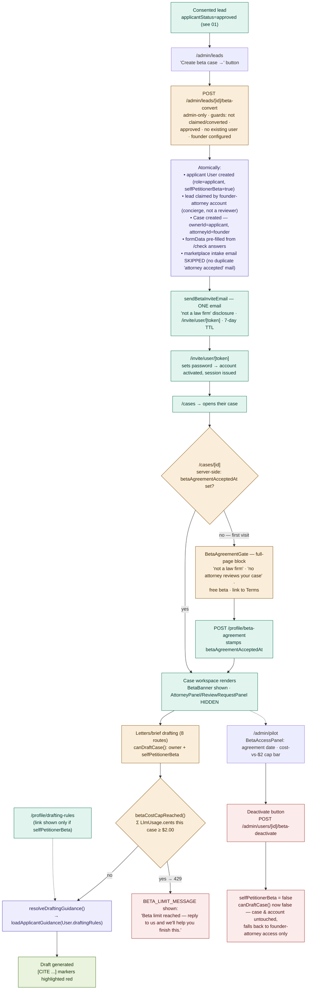

# Self-petitioner beta

A consented lead becomes a free self-drafting beta user: one-click admin
conversion, a single invite email, a hard agreement gate, self-serve drafting
under a per-case cost cap, and an admin kill switch. No fictional attorney
review is ever implied to the applicant. See the architecture overview (no §
yet — shipped 2026-07-01 through 2026-07-04, PRs #300–#305).

Notes:

- Trigger is always admin-initiated (`BetaConvertButton` on `/admin/leads`) —
  there is no self-serve beta signup.
- The "attorney" on a beta case is always the founder's concierge account
  (`FOUNDER_ATTORNEY_EMAIL`), never a real reviewer. This is enforced twice:
  the invite email and agreement text say so explicitly, and the case
  workspace hides `AttorneyPanel`/`ReviewRequestPanel` entirely for beta
  users so the UI can't imply a review is happening.
- The agreement gate is server-enforced in `app/cases/[id]/page.tsx` before
  any case content renders — not just a client-side dialog.
- The $2.00/case cost cap and per-case cost visibility both read the same
  `LlmUsage` ledger the admin leads page already sums for its "cost" column
  — no separate metering system.
- Drafting-rules are per-user (`User.draftingRules`), parallel to the
  attorney-side `FirmProfile` rules; `resolveDraftingGuidance()` is the one
  entry point that branches between them by session role.
- Deactivation is a soft kill switch — it only flips `selfPetitionerBeta`.
  The user, case, and drafts are untouched; `canDraftCase()` simply stops
  granting the self-serve path, and the case falls back to whatever the
  assigned (founder) attorney can already do.
- Feedback is a single `mailto:` link in the persistent `BetaBanner`, not a
  form — deliberately lightweight for a small beta cohort.
